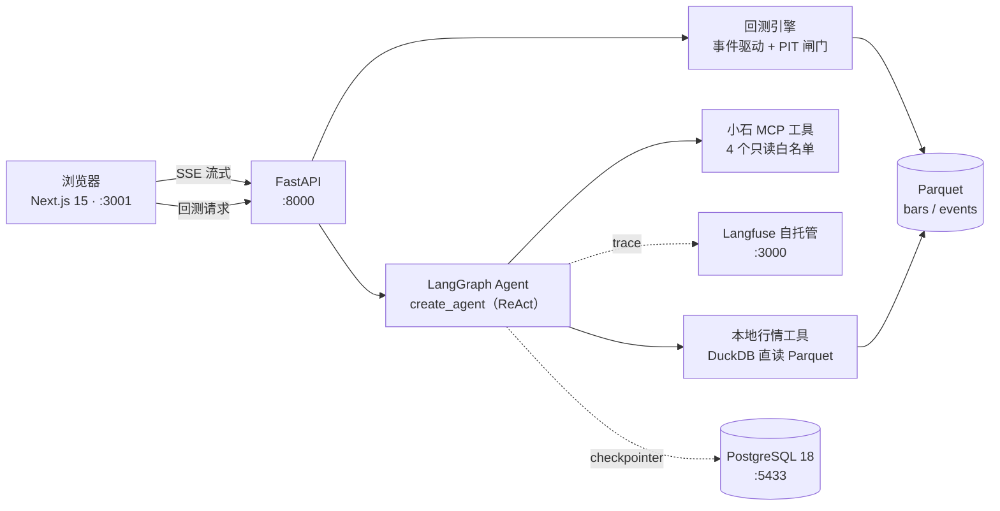
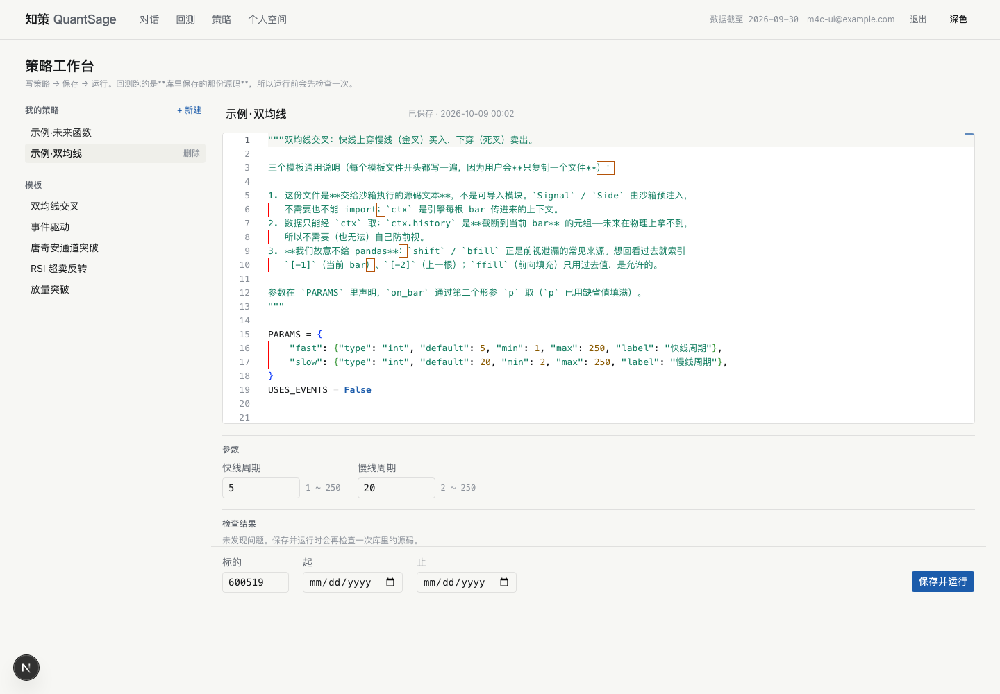
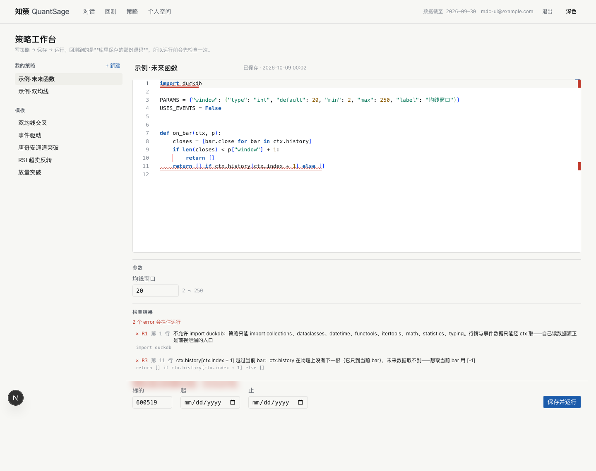

# 知策 QuantSage

**前视偏差为零的 AI 投研 Agent。**

把「平台首次可用时刻」（`available_at`）作为信息可见性的唯一闸门——回测时，Agent 与策略只能看到那个时点之前真正拿得到的信息。绝大多数「LLM + 量化」项目用抓取时间戳或无过滤地检索全量语料，回测结果在无意识地穿越未来；本项目把这条约束压进数据模型与回测引擎，并把它做成可量化的对比。

> 当前进度：**P1-Tn（T1–T7）已完成**，里程碑 `m-p1`。浏览器内可走完两个闭环——对话取证（提问 → Agent 调工具 → 流式作答）与回测验证（选策略与区间 → 指标 / 净值 / K 线买卖点 / PIT 对比 / 交易明细）。下一阶段 P2-Mn（MVP）。

---

## 护城河：PIT 约束

三个时间戳贯穿全链路：

| 字段 | 含义 |
|---|---|
| `event_time` | 事件**事发**时刻 |
| `available_at` | 平台**首次可用**时刻（本项目的闸门） |
| `observed_at` | 本系统**观察到**的时刻 |

PIT（Point-in-Time）模式下，某条事件对某根 K 线是否可见，取 `available_at` 与该 K 线的收盘时刻（15:00 Asia/Shanghai）比较——15:00 之后才可得的消息顺延到下一交易日。非 PIT 模式改用 `event_time`，等同假设「事发即知」，用于量化两种口径的差异。

两个模式的**全部差别压缩在一个方法里**（`backend/app/backtest/events.py` 的 `EventView.stamp()`），下游引擎、策略、报告零感知；同时 `BarContext.history` 是切片元组，策略在物理上拿不到未来 bar。

**实测（3 标的，同一区间）**：非 PIT 相对 PIT 的期末权益差异为 **−0.68% / −4.08% / 0.00%**。

差异方向**不预设、可正可负**：两模式信息集相同、只差时点，「更早入场」不等于更高收益。所以本项目的表述是「PIT 约束保证回测不偷看未来」——**不是**「偷看未来一定赚更多」，后者被自家实测数据推翻。详细读法见 [`docs/tutorials/event_driven.md`](docs/tutorials/event_driven.md)。

回测页上的对比区长这样（同一策略、同一区间，只换设卡口径）：


---

## 架构



- **控制流交给 LangGraph，合规判断交给纯 Python**——风控闸门与校验不做成 LLM 可决定的节点
- **「读」并行、「写」单点**：P1 为单 Agent ReAct 路径；多 Agent 深路径（并行取证 → Bull⇄Bear 辩论 ≤3 轮 → 单点综合 → 代码化风控 → HITL）排在 P2-M8
- 行情与事件都是 Parquet 分片，DuckDB 只读视图直读：行情**零 ETL**（年度整片下载后本地过滤）；事件是**薄 ETL**（M2b：按日归档分片 → 合并成日分区 + 归一化标的数组），落盘即冻结

---

## 界面

**对话页**——SSE 流式渲染，工具调用步骤可展开；回答自带来源标注与事件时间：


**回测页**——参数表单、指标卡、净值曲线与基准、K 线买卖点、PIT 对比表、交易明细、事件表（`event_time` 与 `available_at` 并列 + 来源）：


两个图均可缩放平移（捏合缩放、拖拽平移，净值曲线另有常驻 slider），**各自独立**；竖直滚动始终归还页面。缩放后标题右侧出现「重置缩放」。

**策略工作台**——在线写策略、调参数、跑回测；左侧是「我的策略 + 模板」，编辑器（Monaco，**本地资源、零 CDN**）下方是检查结果与运行条：



护城河在这里延伸到**用户代码层**：一份注入未来函数的策略会在**运行前**被拦下——`ctx.history[ctx.index + 1]`
这类越界索引与 `import duckdb` 这类数据绕行各给一条带行号的 error，编辑器同处出现波浪线：



> 前两张截图由 `pnpm screenshots` 生成；工作台两张由 `node scripts/capture-strategies.mjs` 生成（脚本同时断言标注与拦截确实发生）。两者都可重跑。

---

## 功能一览

**已落地（P1-Tn）**

| 功能 | 内容 |
|---|---|
| 基础设施 | Docker Compose：PostgreSQL 18（宿主 5433）/ Redis / Qdrant；Langfuse v4 全套挂 `observability` profile 默认不启 |
| 数据层 | **全市场 A 股日线**：`cn-daily` 21 片 = 2020–2026 × raw/qfq/hfq，约 5500 只 / 2397 万行，DuckDB 直读 Parquet 零 ETL（单标的查询 < 0.3s、单日全市场聚合 < 0.1s）；**PIT 事件语料同为全市场**（M2b）：按日落盘 `data/events/cn-events_{日期}.parquet`，一条事件一行、标的是数组，带 `source` / `original_source` / `content_hash` 溯源三元组；交易日历冻结为仓库内文件（`app/data/trading_calendar.json`），运行期零第三方依赖 |
| Agent 对话 | LangGraph 单 Agent，经 LiteLLM 网关调 `deepseek-flash`；小石 11 个工具收敛为 4 个只读白名单（动作型工具不进 LLM 工具集）；SSE 五类事件流式；会话列表 / 历史回看 / 删除；Langfuse 全链路 trace |
| RAG 检索（M3） | 事件语料的 **PIT 语义检索**：BGE-M3 双索引（稠密 + 稀疏）落 Qdrant，管线为「`available_at <= as_of` **服务端硬过滤** → 双路召回 → 服务端 RRF(k=61) → bge-reranker-v2-m3 精排」；Agent 工具 `search_events` 可显式传 `as_of`，回答「那个时点当时能看到什么」；自建 200 条中文财经评测集做三档消融（NDCG@10 dense 0.7764 / hybrid 0.7602 / rerank 0.8142） |
| 回测引擎 | 自研最小事件驱动引擎；信号当根收盘生成、次根开盘成交；A 股撮合（100 股整手、佣金万 2.5 最低 5 元、卖出印花税 0.05%、滑点 5bps），费用与滑点独立开关；策略 `ma_cross` / `event_driven` |
| 分析输出 | 总收益 / 年化 / 最大回撤 / 夏普 / 胜率 / 交易次数 + 份额化买入持有基准；`pit_comparison` 量化两口径差异；样本量不足时报告与 UI 双重提示 |
| 前端 | 对话页（流式渲染、工具步骤可视化、停止生成、历史回看）与回测页（指标卡、净值曲线、K 线买卖点、PIT 对比表、交易明细、事件表含来源标注） |
| 教程 | [`ma_cross.md`](docs/tutorials/ma_cross.md)、[`event_driven.md`](docs/tutorials/event_driven.md)——策略逻辑、参数含义、复现命令与期望数字、易误读点 |

**已落地（P2-Mn · M1 完成）**

| 功能 | 内容 |
|---|---|
| 用户系统（M1a / M1b） | 注册 / 登录 / 退出 / 当前用户（bcrypt 哈希 + HS256 JWT，httpOnly + SameSite=Lax cookie）；**用户数据隔离**：会话归属过滤，越权与不存在同返 404、未登录 401；前端受保护路由组与登录守卫 |
| 自选股（M1c） | 加自选 / 分组增删改 / **加自选以来涨幅**（加入时记最近可得收盘价，取不到即留空显示「—」）；加自选表单**边输边给结果**——已在自选就报出分组并把按钮换成「移出」，代码在本地行情里查不到就禁用按钮（输错一位当场拦住） |
| 个人空间（M1c） | 「我的自选 / 我的回测 / 会话历史 / 我的策略」四页签（`/space?tab=`） |
| 我的回测（M1c） | 每次回测落库；摘要列表 + **重开**（`/backtest?run=<id>` 载入完整报告并回填表单） |

**已落地（P2-Mn · M4 完成）**

| 功能 | 内容 |
|---|---|
| 用户策略沙箱（M4a） | `on_bar(ctx[, p])` 契约 + 受限命名空间（**故意不给 pandas**——`shift` / `bfill` 正是前视泄漏的常见来源）；子进程三层配额（CPU `RLIMIT_CPU` / 内存 `ru_maxrss` 看门狗 / 墙钟兜底），故障矩阵逐条验证「坏代码不拖垮服务」 |
| 前视静态检查（M4b） | 只读 AST 的规则表 **R0–R5**（数据绕行 / 未来函数 `shift(-n)`·`bfill` / 显式未来索引 / 声明一致性 / 结构），findings 带行号与中文话术，**error 命中即拒绝执行**；5 个策略模板（双均线与事件驱动是内置策略的源码等价版，逐点等价有测试） |
| 策略工作台（M4c） | `/strategies` 在线编辑器 + 参数表单 + 检查面板 + 「保存并运行」；**先保存才能跑**（回测记录存 `strategy_id` + 源码 sha256，改码后如实标注「已非当次运行的代码」）；「我的策略」与「我的回测」同步接入 |

**规划中**

P2-Mn 其余功能（回测增强 / 模拟盘 / 研报页 / 深度研报多 Agent / 轻量教学 / 研究首页）与 P3-En（架构分层 / 治理 / 可靠性 / 风控 / 对外 MCP Server 等）见 [ROADMAP.md](ROADMAP.md) 与 [docs/PRD.md](docs/PRD.md)。

---

## 技术栈

| 层 | 选型 | P1 落地 |
|---|---|---|
| 编排 | LangGraph 1.2 | ✅ 预置 `create_agent` ReAct 图 |
| 后端 | FastAPI + Pydantic v2 + Uvicorn | ✅ |
| 行情数据 | Parquet + DuckDB | ✅ 只读视图直读，零 ETL |
| 业务库 | PostgreSQL 18 | 🚧 LangGraph checkpointer 已用；Store 待用 |
| 向量库 | Qdrant | ✅ M3 起已用：事件语料 **dense + sparse 双索引**，`available_at <= as_of` 走服务端过滤 |
| 缓存 | Redis | ⬜ compose 里已有服务，P2–P3 接入（限流 / 缓存） |
| 嵌入 / 精排 | BGE-M3 + bge-reranker-v2-m3（FlagEmbedding，CPU） | ✅ M3 起已用：28.9 万条语料全量嵌入 |
| 模型 | `deepseek-flash`（快档）/ `deepseek-v4-pro`（深度档） | 🚧 快档已用；深度档 P2 起 |
| LLM 网关 | LiteLLM | ✅ |
| 前端 | Next.js 15 (App Router) + TS + Tailwind 4 + shadcn/ui | ✅ |
| 图表 | TradingView Lightweight Charts（K 线）/ ECharts（其余） | ✅ |
| 观测 | 自托管 Langfuse 4 | 🚧 Langfuse 已用；OTel P3 补全 |

---

## 快速开始

前置：Docker、[uv](https://docs.astral.sh/uv/)、Node 24 + pnpm、Python 3.12。

```bash
# 1. 配置环境变量（模板含全部 27 个变量与说明）
cp .env.example .env      # 填入 DEEPSEEK_API_KEY 与小石密钥

# 2. 起基础设施（默认三服务；加 --profile observability 连 Langfuse 一起起）
docker compose up -d --wait

# 3. 建 LangGraph checkpointer 表（首次必需）
cd backend && uv sync && uv run python scripts/init_checkpoint_db.py

# 4. 起后端 → http://127.0.0.1:8000
uv run uvicorn app.main:app --port 8000

# 5. 起前端 → http://127.0.0.1:3001（3000 被 Langfuse 占用）
cd ../frontend && pnpm install && pnpm dev
```

没有小石密钥也能跑通回测与前端（行情与事件已在本地落盘）；只有「对话页调小石实时工具」这一步需要授权密钥。

### 跑回测（命令行）

```bash
cd backend
uv run python scripts/run_report.py --symbol 600519 --strategy ma_cross
uv run python scripts/run_report.py --symbol 600519 --strategy event_driven --pit-mode both --json out.json
```

### 测试

```bash
cd backend && uv run pytest                    # 离线 665 项
cd backend && uv run pytest -m integration     # 集成 80 项（需容器与真实密钥）
cd frontend && pnpm test && pnpm typecheck && pnpm lint
```

---

## API

| 方法 | 路径 | 用途 |
|---|---|---|
| GET | `/health` · `/health/ready` | 存活 / 就绪探针（就绪含 Postgres 检查） |
| POST | `/api/v1/auth/register` · `/login` · `/logout` | 注册（即登录态）/ 登录 / 退出，会话经 httpOnly cookie |
| GET | `/api/v1/auth/me` | 当前登录用户（未登录 401） |
| POST | `/api/v1/chat` 🔒 | SSE 流式问答（`token` / `tool_call` / `tool_result` / `done` / `error`） |
| GET | `/api/v1/chat/threads` 🔒 | 会话列表（仅本人，按最近活动倒序） |
| GET · DELETE | `/api/v1/chat/threads/{id}` · `.../messages` 🔒 | 会话历史（含工具步骤）与删除 |
| POST | `/api/v1/backtest` 🔒 | 跑回测并落库，返回信封 `{run_id, report}`（报告含指标 / 净值 / 交易 / PIT 对比）；`strategy="user"` 时带 `strategy_id` 走沙箱 |
| GET | `/api/v1/backtest/runs` · `/runs/{id}` 🔒 | 我的回测摘要列表 / 按 id 取回完整报告（越权 404） |
| GET · POST | `/api/v1/strategies` 🔒 | 我的策略摘要列表 / 建（**草稿也存得下**，findings 随响应返回；撞名 409） |
| GET · PUT · DELETE | `/api/v1/strategies/{id}` 🔒 | 单条（含源码与当前 `code_sha256`）/ 改 / 删（回测记录不级联删） |
| POST | `/api/v1/strategies/check` 🔒 | 源码 → `{findings, meta}`：编辑器标注与参数表单**同一次 AST 解析**（纯函数，不执行代码） |
| GET | `/api/v1/strategies/templates` 🔒 | 5 个策略模板源码 |
| GET · POST | `/api/v1/watchlist` 🔒 | 自选股列表（含最新价与加自选以来涨幅）/ 加自选（重复 409） |
| PATCH · DELETE | `/api/v1/watchlist/{symbol}` 🔒 | 改分组 / 移出自选 |
| PATCH · DELETE | `/api/v1/watchlist/groups/{name}` 🔒 | 重命名分组（撞名即合并）/ 删除分组（组内标的回落默认分组） |
| GET | `/api/v1/market/freshness` | 本地数据最新时点（页头「数据截至 X」的数据源） |
| GET | `/api/v1/market/{symbol}/bars` | 单标的日线（`adjust=qfq\|raw`） |
| GET | `/api/v1/market/{symbol}/probe` | 6 位代码体检（自选股表单边输边查）：本地有没有它、最近交易日与收盘价。**「本地没有」是 200 + `has_data:false`，不是 404** |
| GET | `/api/v1/events` | 事件语料（`event_time` 与 `available_at` 并列，含来源三元组） |
| GET | `/api/v1/etl/status` 🔒 | 语料覆盖 / 缺口 / 最近一次运行 / 调度器状态 |
| POST | `/api/v1/etl/run` 🔒 | 手动触发一次日增量（后台执行，已在跑返回 409） |

交互式文档：后端起来后访问 `/docs`。

🔒 = 需登录（`auth/me`、`chat/*`、`watchlist/*`、`backtest` 与其记录全部受保护；`market` 与 `events` 是非用户资产，保持公开）。会话 cookie 走 `httpOnly + SameSite=Lax`，故前端**跟随页面 host** 访问 API（`localhost` 打开就连 `localhost:8000`）——这样 `localhost` 与 `127.0.0.1` 都能用，不会被浏览器按跨站丢掉 cookie。

---

## 项目结构

```
QuantSage/
├── backend/
│   ├── app/
│   │   ├── agent/      # LangGraph 图、工具白名单、prompt、历史回合合并
│   │   ├── api/        # auth / chat / backtest / watchlist / market / events 六组路由
│   │   ├── backtest/   # 引擎、PIT 闸门、撮合、成本、指标、报告、策略
│   │   ├── core/       # 配置、checkpointer、LLM 与 Langfuse 入口、日志脱敏
│   │   └── data/       # DuckDB 客户端、小石 CLI/MCP 装配
│   ├── scripts/        # 下载、建库、回测与 MCP 验收脚本
│   └── tests/          # 离线 + tests/integration
├── frontend/
│   ├── app/            # / 对话页、/backtest 回测页、/space 个人空间、/login、/register
│   ├── components/     # chat / backtest / space / auth / ui
│   └── lib/            # SSE、图表主题、对话状态机、自选股分组、格式化（纯函数 + 单测）
├── docs/
│   ├── PRD.md          # 需求与验收
│   ├── specs/          # 技术规格（逐阶段滚动）
│   └── tutorials/      # 示例策略教程（含复现命令与期望数字）
├── docker/postgres/init/
└── docker-compose.yml
```

---

## 数据来源与复现边界

行情与事件来自**小石**数据平台（需授权密钥），通过本地 stdio MCP（对话内实时查询）与 `xiaoshi-data` CLI（归档批量下载与校验）两条通道接入。**事件语料走归档**：MCP 单次返回硬顶 500 行且不可翻页，装不下「全市场按日」（实测见 [docs/specs/P2-Mn.md](docs/specs/P2-Mn.md) §3 M2b）。数据落盘后即冻结，**不入 Git**（`/data/` 与 `.tools/` 均被忽略）。

接入命令：

```bash
cd backend
uv run python scripts/download_bars.py                 # 行情：21 片全市场日线（年度整片）
uv run python scripts/download_events.py --backfill    # 事件：回填 92 天（≈ 归档保留期）
uv run python scripts/download_events.py --status      # 覆盖 / 缺口 / 最近一次运行
uv run python scripts/audit_calendar.py                # 交易日历 × 行情全期双向对账
```

因此教程里「照文档逐字复跑即对上数字」的口径有一处前提：**同一份数据快照**。两篇教程头部都写死了快照指纹（Parquet 的 sha256 前 12 位）与事件窗口——换一份快照，数字会变，结构与读法不变。

---

## 已知边界

这是当前进度的诚实清单，避免读者误判完成度：

- **M1 已收口（M1a / M1b / M1c）**：鉴权与归属校验、自选股、个人空间页、「我的回测」全部落地；`POST /api/v1/backtest` 自 M1c 起**落库并需登录**，响应为信封 `{run_id, report}`（报告结构本身未变，见 [docs/specs/P1-Tn.md](docs/specs/P1-Tn.md) §7 的 P2-M1c 加注）
- **自选股的价格取自本地行情快照**：取不到价的标的一律显示「—」，不编数；加入时价是当时最近可得**有价**交易日的收盘价，之后不随行情前移
- **事件语料窗口由数据源决定，回测要么落在窗口内、要么换策略**：新闻源只保留 3 个月（滚动），更早的事件永久不可得，所以本地语料的覆盖区间是「首次回填日 → 最新可用日」——**起点固化、终点随日增量前移**。事件驱动策略对显式早于覆盖起点的请求直接报 400 并给出出路，报告 `meta.event_coverage` 与回测页都显示这次看的是哪一段语料
- **无价 bar 不进定价路径**：数据源用「整行价量为空」表示某天没观测到成交，`bars()` 只返回四价齐全的行——**无价即无价，不是零价**
- **RAG 检索已落地（M3）**：全量事件语料建成 Qdrant 双索引（84 个日分区 / 289,519 点，逐日覆盖对账零差异）；`search_events` 工具走「PIT 服务端硬过滤 → 双路召回 → 服务端 RRF → 精排」，`as_of` 之后才可得的事件**不可能**出现在结果里
- **稀疏腿在本语料上没有增益**（实测 NDCG@10 dense 0.7764 → hybrid 0.7602），精排增益明显（→ 0.8142）；**精排把检索延迟抬到 p95 7.55s**（CPU 上的 cross-encoder），与 PRD「检索 p95 ≤ 500ms」冲突，处置待定——两条都如实写在 [ROADMAP.md](ROADMAP.md) 与 `docs/specs/P2-Mn.md`
- **Redis 在本轮之前未被后端调用**，仍是 compose 里就位的服务（限流 / 缓存留 P2–P3）
- **多 Agent 深路径尚未实现**，P1 是单 Agent ReAct
- **回测引擎为最小实现**：无组合、无模拟盘；`bars < 120` 时年化与夏普会被放大（UI 常驻提示）
- **事件语料的日增量默认不跑**（`ETL_ENABLED=false`）：定时任务要显式打开，或走 `POST /api/v1/etl/run` 手动触发。归档保留期是滚动的，**断供超过 3 个月那段就永久拿不到了**——这也是启动时自动补缺口的原因
- **行情不随日增量更新**：`cn-daily` 是年度整片，日更需重下整片，本轮不做；行情止于导入当天，事件语料则会随 ETL 前移
- **浏览器走查为人工核对**，前端只对纯函数做单测，未引组件测试框架

---

## 文档

| 文档 | 内容 |
|---|---|
| [docs/PRD.md](docs/PRD.md) | 需求、功能清单、验收标准、排期 |
| [docs/specs/](docs/specs/) | 技术规格与变更记录（P1-Tn 已通过） |
| [docs/tutorials/](docs/tutorials/) | 示例策略教程：逻辑、参数、复现命令与期望数字 |
| [ROADMAP.md](ROADMAP.md) | 阶段与功能状态 |
| [CHANGELOG.md](CHANGELOG.md) | 按里程碑的交付记录 |
| [CLAUDE.md](CLAUDE.md) | 项目定位、架构决策与协作规则 |
