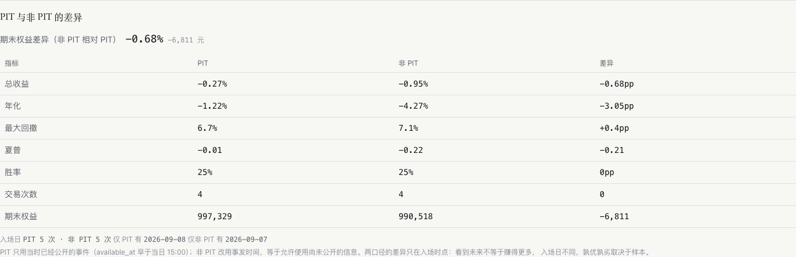
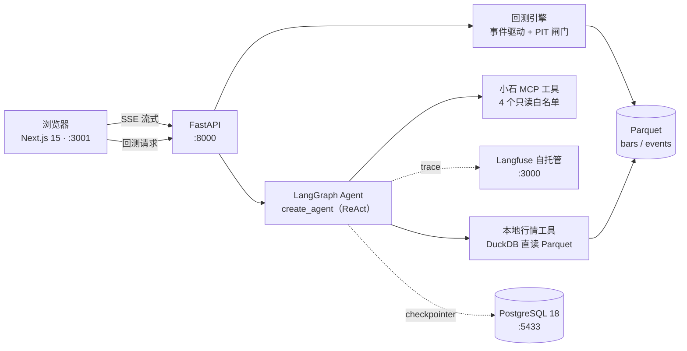
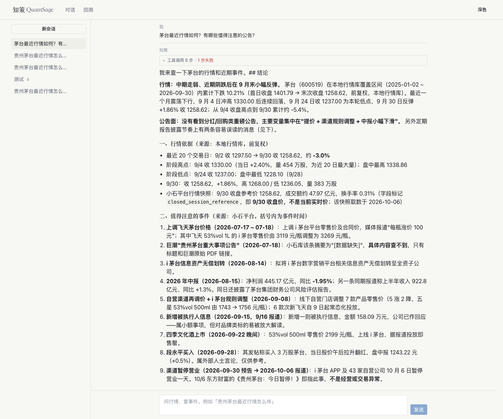
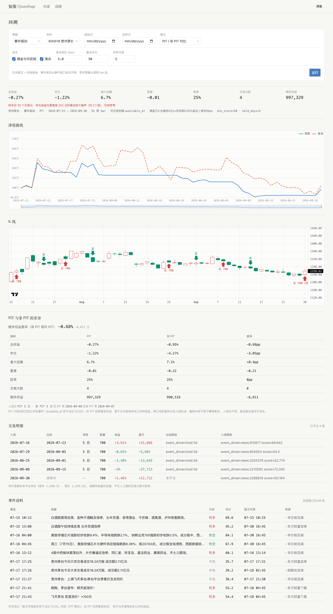

# 知策 QuantSage

**前视偏差为零的 AI 投研 Agent。**

把「平台首次可用时刻」（`available_at`）作为信息可见性的唯一闸门——回测时，Agent 与策略只能看到那个时点之前真正拿得到的信息。绝大多数「LLM + 量化」项目用抓取时间戳或无过滤地检索全量语料，回测结果在无意识地穿越未来；本项目把这条约束压进数据模型与回测引擎，并把它做成可量化的对比。

> 当前进度：**P1-Tn（T1–T7）已完成**，里程碑 `m-p1`。浏览器内可走完两个闭环——对话取证（提问 → Agent 调工具 → 流式作答）与回测验证（选策略与区间 → 指标 / 净值 / K 线买卖点 / PIT 对比 / 交易明细）。下一阶段 P2-Mn（MVP）。

---

## 护城河：PIT 约束

三个时间戳贯穿全链路：

| 字段 | 含义 |
|---|---|
| `event_time` | 事件**事发**时刻 |
| `available_at` | 平台**首次可用**时刻（本项目的闸门） |
| `observed_at` | 本系统**观察到**的时刻 |

PIT（Point-in-Time）模式下，某条事件对某根 K 线是否可见，取 `available_at` 与该 K 线的收盘时刻（15:00 Asia/Shanghai）比较——15:00 之后才可得的消息顺延到下一交易日。非 PIT 模式改用 `event_time`，等同假设「事发即知」，用于量化两种口径的差异。

两个模式的**全部差别压缩在一个方法里**（`backend/app/backtest/events.py` 的 `EventView.stamp()`），下游引擎、策略、报告零感知；同时 `BarContext.history` 是切片元组，策略在物理上拿不到未来 bar。

**实测（3 标的，同一区间）**：非 PIT 相对 PIT 的期末权益差异为 **−0.68% / −4.08% / 0.00%**。

差异方向**不预设、可正可负**：两模式信息集相同、只差时点，「更早入场」不等于更高收益。所以本项目的表述是「PIT 约束保证回测不偷看未来」——**不是**「偷看未来一定赚更多」，后者被自家实测数据推翻。详细读法见 [`docs/tutorials/event_driven.md`](docs/tutorials/event_driven.md)。

回测页上的对比区长这样（同一策略、同一区间，只换设卡口径）：



---

## 架构



- **控制流交给 LangGraph，合规判断交给纯 Python**——风控闸门与校验不做成 LLM 可决定的节点
- **「读」并行、「写」单点**：P1 为单 Agent ReAct 路径；多 Agent 深路径（并行取证 → Bull⇄Bear 辩论 ≤3 轮 → 单点综合 → 代码化风控 → HITL）排在 P2-M8
- 行情与事件为 Parquet 分片，DuckDB 只读视图直读，**零 ETL**

---

## 界面

**对话页**——SSE 流式渲染，工具调用步骤可展开；回答自带来源标注与事件时间：



**回测页**——参数表单、指标卡、净值曲线与基准、K 线买卖点、PIT 对比表、交易明细、事件表（`event_time` 与 `available_at` 并列 + 来源）：



两个图均可缩放平移（捏合缩放、拖拽平移，净值曲线另有常驻 slider），**各自独立**；竖直滚动始终归还页面。缩放后标题右侧出现「重置缩放」。

> 截图由 `pnpm screenshots` 生成，可重跑。

---

## 功能一览

**已落地（P1-Tn）**

| 功能 | 内容 |
|---|---|
| 基础设施 | Docker Compose：PostgreSQL 18（宿主 5433）/ Redis / Qdrant；Langfuse v4 全套挂 `observability` profile 默认不启 |
| 数据层 | 3 标的日线（600519 / 300750 / 600036，各 424 根，2025-01-02 → 2026-09-30）× raw/qfq；PIT 事件语料 355 条（窗口 2026-07-05 → 2026-09-30），落盘即冻结，带 `source` / `original_source` / `content_hash` 溯源三元组 |
| Agent 对话 | LangGraph 单 Agent，经 LiteLLM 网关调 `deepseek-flash`；小石 11 个工具收敛为 4 个只读白名单（动作型工具不进 LLM 工具集）；SSE 五类事件流式；会话列表 / 历史回看 / 删除；Langfuse 全链路 trace |
| 回测引擎 | 自研最小事件驱动引擎；信号当根收盘生成、次根开盘成交；A 股撮合（100 股整手、佣金万 2.5 最低 5 元、卖出印花税 0.05%、滑点 5bps），费用与滑点独立开关；策略 `ma_cross` / `event_driven` |
| 分析输出 | 总收益 / 年化 / 最大回撤 / 夏普 / 胜率 / 交易次数 + 份额化买入持有基准；`pit_comparison` 量化两口径差异；样本量不足时报告与 UI 双重提示 |
| 前端 | 对话页（流式渲染、工具步骤可视化、停止生成、历史回看）与回测页（指标卡、净值曲线、K 线买卖点、PIT 对比表、交易明细、事件表含来源标注） |
| 教程 | [`ma_cross.md`](docs/tutorials/ma_cross.md)、[`event_driven.md`](docs/tutorials/event_driven.md)——策略逻辑、参数含义、复现命令与期望数字、易误读点 |

**规划中**

P2-Mn（用户系统 / 日增量 ETL / RAG 完整化 / 策略工作台 / 回测增强 / 模拟盘 / 研报页 / 深度研报多 Agent / 轻量教学）与 P3-En（架构分层 / 治理 / 可靠性 / 风控 / 对外 MCP Server 等）见 [ROADMAP.md](ROADMAP.md) 与 [docs/PRD.md](docs/PRD.md)。

---

## 技术栈

| 层 | 选型 | P1 落地 |
|---|---|---|
| 编排 | LangGraph 1.2 | ✅ 预置 `create_agent` ReAct 图 |
| 后端 | FastAPI + Pydantic v2 + Uvicorn | ✅ |
| 行情数据 | Parquet + DuckDB | ✅ 只读视图直读，零 ETL |
| 业务库 | PostgreSQL 18 | 🚧 LangGraph checkpointer 已用；Store 待用 |
| 缓存 / 向量库 | Redis / Qdrant | ⬜ compose 里已有服务，P1 未调用（P2–P3 接入） |
| 模型 | `deepseek-flash`（快档）/ `deepseek-v4-pro`（深度档） | 🚧 快档已用；深度档 P2 起 |
| LLM 网关 | LiteLLM | ✅ |
| 前端 | Next.js 15 (App Router) + TS + Tailwind 4 + shadcn/ui | ✅ |
| 图表 | TradingView Lightweight Charts（K 线）/ ECharts（其余） | ✅ |
| 观测 | 自托管 Langfuse 4 | 🚧 Langfuse 已用；OTel P3 补全 |

---

## 快速开始

前置：Docker、[uv](https://docs.astral.sh/uv/)、Node 24 + pnpm、Python 3.12。

```bash
# 1. 配置环境变量（模板含全部 27 个变量与说明）
cp .env.example .env      # 填入 DEEPSEEK_API_KEY 与小石密钥

# 2. 起基础设施（默认三服务；加 --profile observability 连 Langfuse 一起起）
docker compose up -d --wait

# 3. 建 LangGraph checkpointer 表（首次必需）
cd backend && uv sync && uv run python scripts/init_checkpoint_db.py

# 4. 起后端 → http://127.0.0.1:8000
uv run uvicorn app.main:app --port 8000

# 5. 起前端 → http://127.0.0.1:3001（3000 被 Langfuse 占用）
cd ../frontend && pnpm install && pnpm dev
```

没有小石密钥也能跑通回测与前端（行情与事件已在本地落盘）；只有「对话页调小石实时工具」这一步需要授权密钥。

### 跑回测（命令行）

```bash
cd backend
uv run python scripts/run_report.py --symbol 600519 --strategy ma_cross
uv run python scripts/run_report.py --symbol 600519 --strategy event_driven --pit-mode both --json out.json
```

### 测试

```bash
cd backend && uv run pytest                    # 离线 201 项
cd backend && uv run pytest -m integration     # 集成 51 项（需容器与真实密钥）
cd frontend && pnpm test && pnpm typecheck && pnpm lint
```

---

## API

| 方法 | 路径 | 用途 |
|---|---|---|
| GET | `/health` · `/health/ready` | 存活 / 就绪探针（就绪含 Postgres 检查） |
| POST | `/api/v1/chat` | SSE 流式问答（`token` / `tool_call` / `tool_result` / `done` / `error`） |
| GET | `/api/v1/chat/threads` | 会话列表 |
| GET · DELETE | `/api/v1/chat/threads/{id}` · `.../messages` | 会话历史（含工具步骤）与删除 |
| POST | `/api/v1/backtest` | 跑回测，返回指标 / 净值 / 交易 / PIT 对比 |
| GET | `/api/v1/market/{symbol}/bars` | 单标的日线（`adjust=qfq\|raw`） |
| GET | `/api/v1/events` | 事件语料（`event_time` 与 `available_at` 并列，含来源三元组） |

交互式文档：后端起来后访问 `/docs`。

---

## 项目结构

```
QuantSage/
├── backend/
│   ├── app/
│   │   ├── agent/      # LangGraph 图、工具白名单、prompt、历史回合合并
│   │   ├── api/        # chat / backtest / market / events 四组路由
│   │   ├── backtest/   # 引擎、PIT 闸门、撮合、成本、指标、报告、策略
│   │   ├── core/       # 配置、checkpointer、LLM 与 Langfuse 入口、日志脱敏
│   │   └── data/       # DuckDB 客户端、小石 CLI/MCP 装配
│   ├── scripts/        # 下载、建库、回测与 MCP 验收脚本
│   └── tests/          # 离线 + tests/integration
├── frontend/
│   ├── app/            # / 对话页、/backtest 回测页
│   ├── components/     # chat / backtest / ui
│   └── lib/            # SSE、图表主题、对话状态机、格式化（纯函数 + 单测）
├── docs/
│   ├── PRD.md          # 需求与验收
│   ├── specs/          # 技术规格（逐阶段滚动）
│   └── tutorials/      # 示例策略教程（含复现命令与期望数字）
├── docker/postgres/init/
└── docker-compose.yml
```

---

## 数据来源与复现边界

行情与事件来自**小石**数据平台（需授权密钥），通过本地 stdio MCP（在线查询）与 `xiaoshi-data` CLI（批量下载与校验）两条通道接入。数据落盘后即冻结，**不入 Git**（`/data/` 与 `.tools/` 均被忽略）。

因此教程里「照文档逐字复跑即对上数字」的口径有一处前提：**同一份数据快照**。两篇教程头部都写死了快照指纹（Parquet 的 sha256 前 12 位）与事件窗口——换一份快照，数字会变，结构与读法不变。

---

## 已知边界

这是 P1 的诚实清单，避免读者误判完成度：

- **单用户 demo，无鉴权与归属校验**——会话与回测无用户隔离，P2-M1 的第一道门
- **Redis 与 Qdrant 在 P1 未被后端调用**，只是 compose 里就位的服务（RAG 属 P2-M3）
- **多 Agent 深路径尚未实现**，P1 是单 Agent ReAct
- **回测引擎为最小实现**：无组合、无模拟盘、无常驻调度；`bars < 120` 时年化与夏普会被放大（UI 常驻提示）
- **事件语料在线窗口约 3 个月**，归档入口同样受限；长历史只能靠日增量积累（P2-M2 的日增量 ETL 正是为此）
- **浏览器走查为人工核对**，前端只对纯函数做单测，未引组件测试框架

---

## 文档

| 文档 | 内容 |
|---|---|
| [docs/PRD.md](docs/PRD.md) | 需求、功能清单、验收标准、排期 |
| [docs/specs/](docs/specs/) | 技术规格与变更记录（P1-Tn 已通过） |
| [docs/tutorials/](docs/tutorials/) | 示例策略教程：逻辑、参数、复现命令与期望数字 |
| [ROADMAP.md](ROADMAP.md) | 阶段与功能状态 |
| [CHANGELOG.md](CHANGELOG.md) | 按里程碑的交付记录 |
| [CLAUDE.md](CLAUDE.md) | 项目定位、架构决策与协作规则 |
